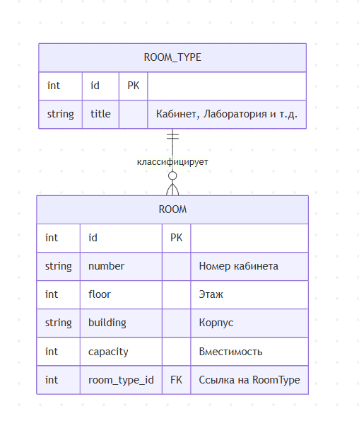

# Вариант №17. 
**Исполнитель:** Нечаев Артем Дмитриевич
**Группа:** 24-1П11

## 1. Добавить Аудиторию
**Параметры запроса:**

| Параметр | Обязательность | Тип | Ограничение | Значение по умолчанию |
| :--- | :--- | :--- | :--- | :--- |
| number | Да | String | Не пустая строка | — |
| floor | Да | Integer | >= 0 | — |
| building | Да | String | Не пустая строка | — |
| capacity | Да | Integer | > 0 | — |
| room_type_id | Да | Integer | Существующий ID в RoomType | — |

**Уникальные комбинации:**
* number + building (один номер кабинета в конкретном корпусе).

**Возвращаемая информация (в случае успеха):**

| Параметр | Тип |
| :--- | :--- |
| id | Integer |
| number | String |
| floor | Integer |
| building | String |
| capacity | Integer |
| room_type_id | Integer |

------------------------------

## 2. Изменить Аудиторию по ID
**Параметры запроса:**

| Параметр | Обязательность | Тип | Ограничение | Значение по умолчанию |
| :--- | :--- | :--- | :--- | :--- |
| number | Нет | String | Не пустая строка | Текущее значение |
| floor | Нет | Integer | >= 0 | Текущее значение |
| building | Нет | String | Не пустая строка | Текущее значение |
| capacity | Нет | Integer | > 0 | Текущее значение |
| room_type_id | Нет | Integer | Существующий ID в RoomType | Текущее значение |

**Возвращаемая информация:**

| Параметр | Тип |
| :--- | :--- |
| id | Integer |
| status | String (e.g. "updated") |

------------------------------

## 3. Удаление Аудитории по ID
Метод принимает **id** (Integer).

* **Результат:** True, если запись была удалена; False, если запись с таким ID не найдена.

------------------------------

## 4. Получить Аудиторию по ID
**Возвращаемая информация:**

| Параметр | Тип |
| :--- | :--- |
| id | Integer |
| number | String |
| floor | Integer |
| building | String |
| capacity | Integer |
| room_type | String (Название типа) |

------------------------------

## 5. Получить список Аудиторий по параметрам
**Входные фильтры (необязательные):**

| Параметр | Тип | Описание |
| :--- | :--- | :--- |
| floor | Integer | Фильтр по этажу |
| building | String | Фильтр по корпусу |
| room_type_id | Integer | Фильтр по типу помещения |

**Формат элементов результирующего списка:**

| Параметр | Тип |
| :--- | :--- |
| id | Integer |
| number | String |
| building | String |
| capacity | Integer |

------------------------------

## ER-диаграмма

